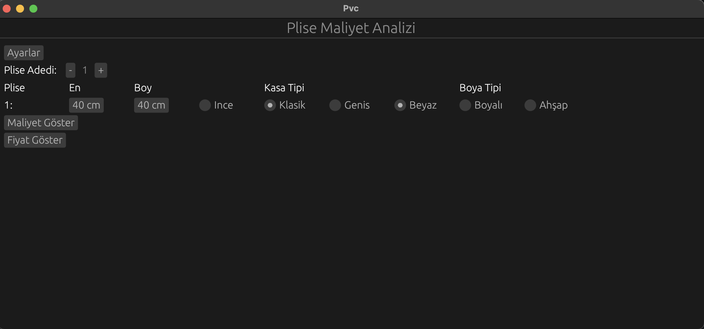
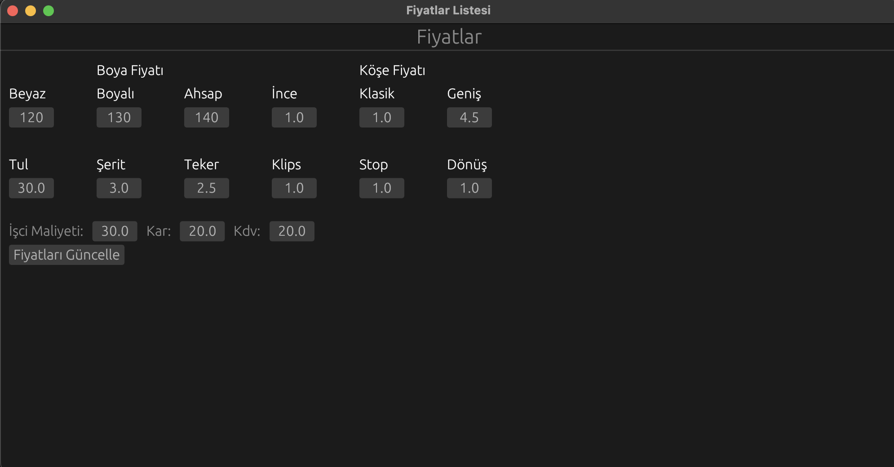

# PVC Cost Analysis Tool

## Introduction
This repository contains the PVC Cost Analysis Tool, an application designed to calculate and display the cost and pricing of pleated products. It allows users to enter dimensions, select material and style options, and then view the corresponding cost and price calculations.

## Features
- Enter dimensions for pleated items.
- Select from various materials like classic, wide, white, colored, or wood.
- View cost calculations based on input parameters.
- Display prices with the ability to update and modify various components such as paint, fabric, and labor costs.
- Simple and intuitive user interface.

## Screenshots



## How to Use
To use this tool:
1. Enter the number of pleats and their dimensions.
2. Choose the case type and paint type.
3. Click on 'Malıyet Göster' to display the cost or 'Fiyat Göster' to display the price.
4. Navigate to the 'Fiyatlar' tab to update the price components as needed.

## Installation

```bash
cargo run
```


